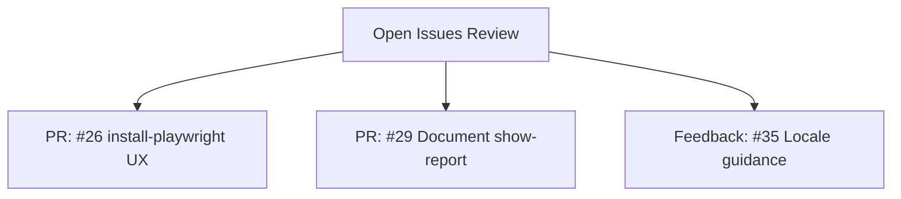
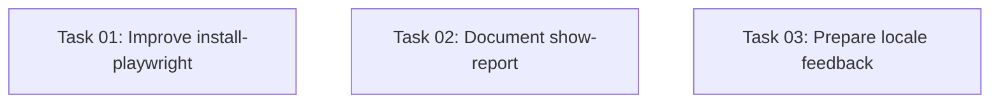

# Plan: Review and Address Open GitHub Issues

## Original Work Order

> I would like to review every open issue in this repository except the Dependency Dashboard. We need to determine how to solve each issue - either with code changes, or feedback in the issue, or closing the issue. For this plan, when it comes to making changes we **MUST NOT** touch or change the issues. Only work in pull requests, and provide feedback on what I could change in the issues.

## Plan Clarifications

| Question | Answer |
|----------|--------|
| Issue #26: The Dockerfile `npx` bug was already fixed. The remaining problem is `install-playwright` UX on fresh clones. Fix those remaining issues? | Yes, fix the remaining UX issues in #26 |
| Issues #30 and #38 (headed mode / X server): combine into one PR or keep separate? | Skip both — maintainer will handle them directly |
| Issue #28 (CI migration to standard test template): approach? | Create a separate dedicated plan (Plan 02) |
| Issue #34 (HTTPS error inside KasmVNC): code fix or feedback? | Skip — maintainer will handle directly |

## Executive Summary

After reviewing all 7 open issues (excluding the Dependency Dashboard) against the codebase and issue comments, this plan addresses the 3 issues that are actionable now. Issue #26 needs UX improvements to the `install-playwright` host script (the original Dockerfile bug was already fixed in commit `c908db7`). Issue #29 needs a README update documenting the `show-report` command. Issue #35 needs feedback guidance for the user about locale configuration. Issues #28, #30, #34, and #38 are either handled in a separate plan or by the maintainer directly.

All work is done through pull requests. For feedback-only issues, we prepare response text for the maintainer to post.

## Context

### Current State vs Target State

| # | Issue | Current State | Target State | Action Type |
|---|-------|--------------|--------------|-------------|
| 26 | npm error could not determine executable to run | Dockerfile bug is fixed, but `install-playwright` fails silently on fresh clones without `node_modules`; no documentation on when/why to run it | `install-playwright` validates prerequisites and provides clear error messages; README documents the workflow | **PR: Bug fix + docs** |
| 29 | Document the show-report command | `show-report --host=0.0.0.0` is undocumented despite being discussed in issue #8 | README documents how to view test reports using the show-report command | **PR: Documentation** |
| 35 | How to change locale for HTML report | No guidance on changing the date format in Playwright HTML reports | Provide feedback explaining that `LANG`/`LC_ALL` env vars in DDEV's `web_environment` control Node.js `Intl.DateTimeFormat()` output | **Feedback only** |

### Issues Out of Scope

| # | Issue | Reason |
|---|-------|--------|
| 41 | Dependency Dashboard | Excluded per work order |
| 28 | Consider using standard add-on test template | Addressed in Plan 02 |
| 30 | Fix headed browserType.launch has been closed | Maintainer will investigate directly |
| 38 | Add more docs regarding X and headed mode | Maintainer will investigate directly (related to #30) |
| 34 | HTTPS error in KasmVNC | Maintainer will handle directly |

### Background

The repository is a DDEV addon that integrates Playwright testing into the DDEV web container. Key context for the in-scope issues:

- The `install-playwright` host command (`commands/host/install-playwright`) currently only checks for `test/playwright/package.json`. When it finds the file, it copies `disabled.Dockerfile.playwright` to `Dockerfile.playwright` and triggers `ddev restart`. The pre-start hook in `config.playwright.yml` then copies `test/playwright/` into `.ddev/web-build/playwright/` for the Docker build context. The Dockerfile runs `npm install` or `yarn` on that copy. If the project is in a broken state (e.g., missing lock file, missing `@playwright/test` dependency), the failure surfaces as an opaque Docker build error.
- The BATS test for npm (`test.bats` line 92) runs `ddev exec -d /var/www/html/test/playwright npm ci` before `ddev install-playwright`, confirming that having dependencies resolved first is part of the expected workflow — but this is undocumented.
- The `show-report` command was discussed in issue #8 and requires `--host=0.0.0.0` to be accessible from outside the container. Reports are served on the exposed HTTPS port 9324 (container port 9323, defined in `config.playwright.yml`).
- Playwright's HTML report uses `Intl.DateTimeFormat()` in Node.js (not in the browser), so locale changes must target the Node.js runtime environment, not Playwright's browser `locale` config.

## Architectural Approach



### Issue #26 — Improve `install-playwright` error handling and documentation

**Objective**: Make `install-playwright` resilient to fresh project clones and provide clear guidance when prerequisites are missing.

The Dockerfile's package manager detection was already fixed in commit `c908db7`. The remaining problem, per the reporter's comments, is that `ddev install-playwright` fails with opaque Docker build errors on fresh clones where dependencies haven't been installed. The BATS tests confirm the expected workflow: run `npm ci` or `yarn` inside the container first, then run `install-playwright`.

Changes to `commands/host/install-playwright`:

1. **Validate `@playwright/test` is a dependency**: After the existing `package.json` check, verify that `@playwright/test` (or `playwright`) appears in the file's dependencies or devDependencies. If not, display an error message explaining that Playwright must be initialized first (with the `npm init playwright@latest` / `yarn create playwright` commands already shown).
2. **Provide prerequisite guidance**: Before triggering the rebuild, print a message reminding the user that `npm install` / `yarn` should have been run inside the container first (via `ddev exec`). This catches the fresh-clone scenario where `package.json` exists but dependencies were never installed.

Changes to `README.md`:

1. **Clarify the setup workflow**: Document that the full sequence is: (a) initialize Playwright, (b) run `npm install`/`yarn` inside the container, (c) run `ddev install-playwright` to bake browsers into the image.
2. **Document when to re-run**: Note that `install-playwright` should be re-run after updating Playwright versions to rebake browser binaries.

### Issue #29 — Document the show-report command

**Objective**: Add README documentation for viewing Playwright HTML test reports.

Add a section to the README documenting:
- `ddev playwright show-report --host=0.0.0.0` serves the HTML report
- The report is accessible at `https://<project>.ddev.site:9324`
- The `--host=0.0.0.0` flag is required so the report server binds to all interfaces (not just localhost inside the container)

### Issue #35 — Locale feedback for maintainer to post

**Objective**: Prepare response text explaining how to change the date format in Playwright HTML reports.

The key insight is that the HTML report date is generated by Node.js using `Intl.DateTimeFormat()`, which reads the system locale — not Playwright's browser `locale` configuration. The correct approach is to set `LANG` and `LC_ALL` environment variables in DDEV's web environment:

```yaml
# .ddev/config.yaml
web_environment:
  - LANG=en_GB.UTF-8
  - LC_ALL=en_GB.UTF-8
```

The feedback should note:
- Playwright's `use.locale` in `playwright.config.ts` only affects the browser context during tests, not report generation
- The desired locale package may need to be installed in the Debian container (e.g., via a custom Dockerfile step: `RUN apt-get update && apt-get install -y locales && sed -i '/en_GB.UTF-8/s/^# //' /etc/locale.gen && locale-gen`)
- The user should test with `ddev exec locale` to verify the locale is active

## Risk Considerations and Mitigation Strategies

<details>
<summary>Technical Risks</summary>

- **Issue #26 validation may be too strict**: Checking for `@playwright/test` in `package.json` could fail if the user uses the `playwright` package directly instead.
    - **Mitigation**: Check for either `@playwright/test` or `playwright` in `package.json`. Use a simple `grep` — no need to parse JSON in bash.

- **Issue #35 locale may not be installed in container**: Setting `LANG=en_GB.UTF-8` without the locale package installed will have no effect.
    - **Mitigation**: The feedback text explicitly mentions the locale installation step. This is guidance for the user, not a code change we make.

</details>

<details>
<summary>Implementation Risks</summary>

- **Issue #26 `install-playwright` runs on the host**: The script at `commands/host/install-playwright` executes on the host machine, not inside the container. It can read files from the project directory but cannot run `npm` or check `node_modules` inside the container. Validation must use file-based checks on the host filesystem.
    - **Mitigation**: Check `test/playwright/package.json` contents with `grep`. For the "run npm install first" guidance, this is a printed recommendation, not a hard gate — the Docker build's own `npm install` step may succeed even without a prior install.

</details>

## Success Criteria

### Primary Success Criteria
1. A PR is created for issue #26 improving `install-playwright` with prerequisite validation and clearer error messages
2. A PR is created for issue #29 documenting the `show-report` command in the README
3. Feedback text is prepared for issue #35 that the maintainer can post as a comment
4. All PRs pass CI checks (BATS tests on stable + HEAD DDEV)
5. No existing functionality is broken by the changes

## Self Validation

- For issue #26: Verify the `install-playwright` script exits with a clear error when `package.json` exists but doesn't contain `@playwright/test` or `playwright` as a dependency
- For issue #26: Verify the script still works normally when prerequisites are met (the existing BATS tests cover this path)
- For issue #29: Read the updated README section and verify the command, port, and `--host` flag are accurately documented against `config.playwright.yml`
- Run the BATS test suite to verify no regressions

## Documentation

- README.md updates for:
  - Issue #26: Clarify the `install-playwright` workflow, prerequisites, and when to re-run
  - Issue #29: Document the `show-report --host=0.0.0.0` command and port 9324

## Resource Requirements

### Development Skills
- Bash scripting (install-playwright script improvements)
- DDEV addon architecture understanding
- Playwright configuration knowledge

### Technical Infrastructure
- GitHub CLI (`gh`) for creating PRs

## Execution Blueprint

**Validation Gates:**
- Reference: `/config/hooks/POST_PHASE.md`

### Dependency Diagram



All tasks are independent — no dependencies between them.

### Phase 1: Execute All Tasks
**Parallel Tasks:**
- Task 01: Improve install-playwright error handling and documentation
- Task 02: Document the show-report command
- Task 03: Prepare locale feedback for issue #35

### Execution Summary
- Total Phases: 1
- Total Tasks: 3
- Maximum Parallelism: 3 tasks (in Phase 1)
- Critical Path Length: 1 phase

## Notes

- The Dependency Dashboard (issue #41) is explicitly excluded per the work order
- Issues must NOT be modified directly — all changes go through PRs, and feedback is provided to the maintainer to post on issues
- Issue #28 (standard test template migration) is addressed in Plan 02
- Issues #30, #34, and #38 are being handled by the maintainer directly

### Change Log
- 2026-03-12: Initial plan created covering all 7 issues
- 2026-03-12: First refinement — removed issues #28 (separate plan), #30, #34, #38 (maintainer-handled). Corrected #26 analysis (Dockerfile already fixed, real issue is install-playwright UX). Corrected #35 feedback (Node.js locale, not browser locale). Added Plan Clarifications table.
- 2026-03-12: Second refinement — clarified #26 validation specifics (what to check in `package.json`, host-only execution constraint, relationship to BATS test workflow). Added locale package installation note to #35 feedback. Added background detail about `config.playwright.yml` pre-start hooks and port mappings.
