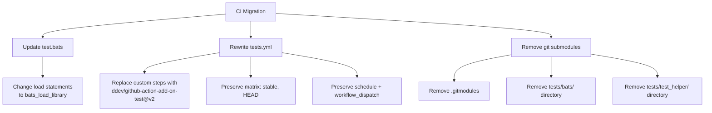

# Plan: Migrate CI to Standard DDEV Add-on Test Template

## Original Work Order

> Migrate the CI test workflow (.github/workflows/tests.yml) to use the standard DDEV add-on test template with `ddev/github-action-add-on-test@v2` as requested in GitHub issue #28. The current workflow has custom steps for Homebrew setup, mkcert, git submodules, Docker image pre-pull, and supports a matrix of ddev_version: [stable, HEAD]. The migration should preserve the existing test matrix and BATS test execution while reducing maintenance burden.

## Plan Clarifications

| Question | Answer |
|----------|--------|
| Migrate BATS from git submodules to Homebrew-installed, or keep submodules with `disable_checkout_action` workaround? | Fully migrate away from git submodules to Homebrew-installed BATS |
| Keep the daily cron schedule? | Yes |

## Executive Summary

The current CI workflow (`tests.yml`) is a hand-rolled 85-line workflow that manually handles Homebrew setup, mkcert installation, DDEV installation, Docker image pre-pull, and tmate debugging. The standard `ddev/github-action-add-on-test@v2` composite action handles all of this automatically. Migrating to it eliminates ~60 lines of workflow boilerplate and aligns with the DDEV add-on ecosystem convention, reducing future maintenance burden (e.g., no manual fixes when upstream actions change like the keepalive incident mentioned in issue #28).

The migration also removes the 3 BATS git submodules (`bats-core`, `bats-support`, `bats-assert`) in favor of Homebrew-installed versions, which the standard action provides automatically. This requires updating the test file's library loading pattern.

## Context

### Current State vs Target State

| Current State | Target State | Why? |
|--------------|--------------|------|
| 85-line custom workflow with manual Homebrew, mkcert, DDEV install, Docker pre-pull steps | ~30-line workflow using `ddev/github-action-add-on-test@v2` | Reduces maintenance burden; aligns with ecosystem convention |
| BATS installed via git submodules (`tests/bats/`, `tests/test_helper/bats-support/`, `tests/test_helper/bats-assert/`) | BATS installed via Homebrew by the standard action | Eliminates submodule management; versions stay current via Homebrew |
| Tests loaded with `load 'test_helper/bats-support/load'` | Tests loaded with `bats_load_library 'bats-support'` | Standard pattern used by all DDEV add-ons using the action |
| Test runner invoked as `./tests/bats/bin/bats -t tests` | Test runner invoked as `bats tests` (Homebrew binary) | No longer depends on submodule binary |
| `.gitmodules` file with 3 submodule entries | `.gitmodules` file removed | No more submodules to manage |

### Background

The `ddev/github-action-add-on-test@v2` is a composite GitHub Action maintained by the DDEV team. It automatically handles: Homebrew setup, BATS + helpers installation via Homebrew, mkcert setup, DDEV installation (stable or HEAD), Docker image pre-pull, and tmate debugging. It accepts `ddev_version`, `token`, `debug_enabled`, `addon_repository`, `addon_ref`, and optionally `test_command` and `disable_checkout_action`.

Key behaviors of the action:
- For `push`/`pull_request` events, it runs `bats tests --filter-tags !release` (skips release-tagged tests)
- For all other events (schedule, workflow_dispatch), it runs `bats tests` (includes all tests)
- It sets `DDEV_NONINTERACTIVE=true`, `DDEV_NO_INSTRUMENTATION=true`, and `DDEV_GITHUB_TOKEN`

The action does NOT handle git submodules in its built-in checkout. Since we're migrating away from submodules entirely, this is not a concern.

## Architectural Approach



### Update BATS Test Loading

**Objective**: Switch from submodule-relative `load` to Homebrew-aware `bats_load_library`.

The `setup()` function in `tests/test.bats` currently uses:
```
load 'test_helper/bats-support/load'
load 'test_helper/bats-assert/load'
```

This must change to:
```
bats_load_library 'bats-support'
bats_load_library 'bats-assert'
```

The `bats_load_library` function is built into `bats-core` and resolves libraries from standard paths (including Homebrew's install location). No other changes to `test.bats` are needed — all test logic, assertions, and helper functions remain identical.

### Rewrite the Workflow File

**Objective**: Replace the hand-rolled workflow with one that delegates to the standard action.

The new `.github/workflows/tests.yml` should:
- Keep the same triggers: `pull_request`, `push` (main), `schedule` (daily cron), `workflow_dispatch` (with `debug_enabled` input)
- Keep the matrix strategy: `ddev_version: [stable, HEAD]` with `fail-fast: false`
- Use `ddev/github-action-add-on-test@v2` as the single step in the job, passing `ddev_version`, `token`, `debug_enabled`, `addon_repository`, and `addon_ref`
- Remove all manual steps: Homebrew setup, `brew update && brew upgrade`, mkcert, submodule init/update, DDEV install conditionals, Docker image download, tmate setup

The action's built-in checkout does not need `submodules: true` since we're removing submodules.

The commented-out `edge` and `PR` matrix options are not supported by the standard action and should be removed. If needed in the future, they can be added back with custom steps.

### Remove Git Submodules

**Objective**: Clean up the 3 BATS submodules that are no longer needed.

Remove:
- `.gitmodules` file
- `tests/bats/` directory (bats-core submodule)
- `tests/test_helper/bats-support/` directory
- `tests/test_helper/bats-assert/` directory

Git submodule removal requires `git rm` for each submodule path, which also updates `.gitmodules`. After removing all three, `.gitmodules` will be empty and should be deleted.

## Risk Considerations and Mitigation Strategies

<details>
<summary>Technical Risks</summary>

- **BATS version mismatch**: The Homebrew-installed BATS version may differ from the pinned submodule version, potentially causing test behavior differences.
    - **Mitigation**: The tests use basic `assert`, `assert_output`, `assert_failure` — standard features that are stable across BATS versions. Risk is very low.

- **Standard action may not support a feature we need in the future**: The action only supports `stable` and `HEAD` DDEV versions, not `edge` or `PR`.
    - **Mitigation**: The `edge` and `PR` options are already commented out and unused. If needed later, the workflow can add custom steps alongside the action or use `test_command` for custom execution.

</details>

<details>
<summary>Implementation Risks</summary>

- **`bats_load_library` path resolution**: If Homebrew installs BATS libraries in a non-standard location, `bats_load_library` may fail.
    - **Mitigation**: The standard action explicitly installs `bats-support` and `bats-assert` from the `bats-core/bats-core` Homebrew tap. This is the same setup used by dozens of DDEV add-ons. The CI environment is `ubuntu-24.04` where this is well-tested.

</details>

## Success Criteria

### Primary Success Criteria
1. The rewritten workflow passes CI on both `stable` and `HEAD` DDEV versions
2. All 3 existing BATS tests pass without modification to test logic
3. Git submodules are fully removed (no `.gitmodules`, no submodule directories)
4. The workflow file is significantly shorter and delegates to the standard action
5. Schedule and workflow_dispatch triggers continue to work

## Self Validation

- Push the PR and verify CI passes on both matrix entries (stable + HEAD)
- Verify that `bats_load_library` resolves `bats-support` and `bats-assert` in the CI logs
- Confirm `.gitmodules` is deleted and `tests/bats/`, `tests/test_helper/` directories are removed
- Review the workflow file to ensure no manual setup steps remain that the action handles

## Documentation

- No README changes needed — the CI workflow is an internal concern
- The PR description should reference issue #28 and explain the migration

## Resource Requirements

### Development Skills
- GitHub Actions workflow configuration
- Git submodule management (removal)
- BATS testing framework (load patterns)

### Technical Infrastructure
- GitHub CI runners (ubuntu-24.04)
- `ddev/github-action-add-on-test@v2` composite action

## Notes

- This plan was split out from Plan 01 (open issues review) per maintainer request
- References GitHub issue #28: "Consider using standard add-on test template"
- The `copilot-setup-steps.yml` workflow is unrelated and should not be modified
- The `conventional-commits.yml` workflow is unrelated and should not be modified
