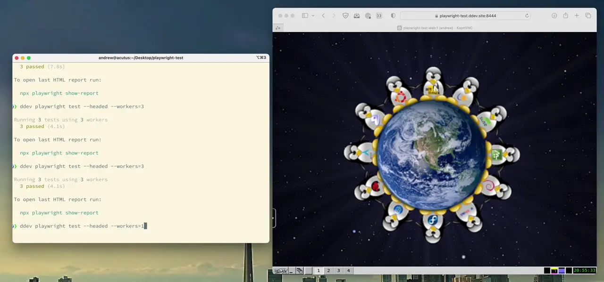

[](https://github.com/deviantintegral/ddev-playwright/actions/workflows/tests.yml) 

# ddev-playwright <!-- omit in toc -->


_Example test validating phpinfo(), slowed down for the demo._

* [What is ddev-playwright?](#what-is-ddev-playwright)
* [Getting started](#getting-started)

## What is ddev-playwright?

This repository contains an addon for integrating Playwright tests into your ddev project.

Highlights include:

* Support for both npm and yarn.
* Support for running headless tests.
* Support for running headed tests with remote access to the UI through your web browser.
* Only installs the heavy Playwright dependencies if a given local opts in to them.
* Does not require running Playwright in ddev, in case developers prefer to run on the host on locals.
* Optimizations to reduce build time, especially on locals when ddev versions are upgraded.

## Getting started

```console
ddev get https://github.com/deviantintegral/ddev-playwright
git add .
git add -f .ddev/config.playwright.yml
mkdir -p test/playwright
# To install with npm.
ddev exec -d /var/www/html/test/playwright npm init playwright@latest
# Or yarn.
ddev exec -d /var/www/html/test/playwright yarn create playwright

# Required for KasmVNC to work until ddev 1.22 is released.
# https://ddev.readthedocs.io/en/latest/users/configuration/experimental/
ddev config global --use-traefik

# Add ignoreHTTPSErrors: true in test/playwright/playwright.config.ts to support HTTPS in tests.
# Now, install playwright dependencies and cache them for later.
ddev install-playwright
# To run playwright's test command.
ddev playwright test
# To run with the UI.
ddev playwright test --headed
# To generate playwright code by browsing.
ddev playwright codegen
```

The following services are exposed with this addon:

| Service                 | URL                               | Notes                                                                                      |
|-------------------------|-----------------------------------|--------------------------------------------------------------------------------------------|
| KasmVNC                 | https://\<PROJECT>.ddev.site:8444 | Username is your local username. Password is `secret`.                                     |
| Playwright Test Reports | https://\<PROJECT>.ddev.site:9324 | This port is changed from the default to not conflict with running Playwright on the host. |

## Similar Tools

[julienloizelet/ddev-playwright](https://github.com/julienloizelet/ddev-playwright) was a great inspiration for this work. It uses Playwright containers built by Microsoft for tests. [A few questions on the implementation](https://github.com/julienloizelet/ddev-playwright/issues/3) has some notes on the differences in the implementations. The main differences are:

1. This addon stacks Playwright and KasmVNC into the web container. This makes accessing the system being tested (like Drupal) much easier. For example, with a Drupal site Playwright can easily call `drush` or other CLI tools to set up tests.
2. The official containers do not ship with any sort of remote access to the Playwright UI. This repository includes KasmVNC to run tests in headed mode or to generate code.
3. By stacking Playwright into the web container, it simplifies permissions for writing Playwright's test reports back out.
4. We hope to be able to integrate [chanzuckerberg/axe-storybook-testing](https://github.com/chanzuckerberg/axe-storybook-testing) in the future, which should be simplier with having Playwright's dependencies combined into the current project.
