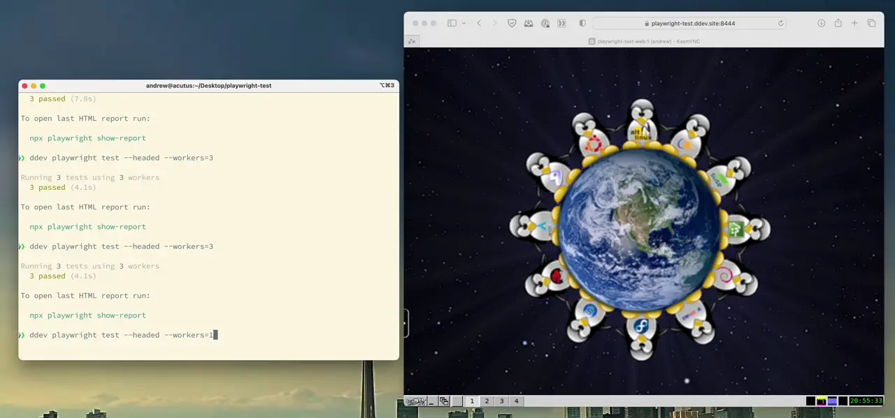

[](https://github.com/deviantintegral/ddev-playwright/actions/workflows/tests.yml)

# ddev-playwright <!-- omit in toc -->


_Example test validating phpinfo(), slowed down for the demo._

* [What is ddev-playwright?](#what-is-ddev-playwright)
* [Getting started](#getting-started)
* [SQLite tmpfs mount](#sqlite-tmpfs-mount)
* [Playwright CLI for AI coding agents](#playwright-cli-for-ai-coding-agents)
* [Contributing](#contributing)

## What is ddev-playwright?

This repository contains an addon for integrating Playwright tests into your ddev project.

Highlights include:

* Support for both npm and yarn.
* Support for running headless tests.
* Support for running headed tests with remote access to the UI through your web browser.
* Only installs the heavy Playwright dependencies if a given local opts in to them.
* Does not require running Playwright in ddev, in case developers prefer to run on the host on locals.
* Optimizations to reduce build time, especially on locals when ddev versions are upgraded.

## Getting started

The full setup workflow is:

1. **Install the addon** and commit the generated configuration.
2. **Initialize Playwright** inside the container (creates `package.json`, config, etc.).
4. **Run `ddev install-playwright`** to rebuild the web service with browser dependencies.

> **Tip:** Re-run `ddev restart` any time you update the Playwright
> version in `test/playwright/package.json` so the matching browser binaries are
> installed.

```console
# 1. Install the addon.
ddev add-on get Lullabot/ddev-playwright
git add .
git add -f .ddev/config.playwright.yml

# 2. Initialize Playwright (choose npm or yarn).
mkdir -p test/playwright
ddev exec -d /var/www/html/test/playwright npm init playwright@latest
# Or yarn:
# ddev exec -d /var/www/html/test/playwright yarn create playwright

# Add ignoreHTTPSErrors: true in test/playwright/playwright.config.ts to support HTTPS in tests.

# 3. Install Playwright browser dependencies and cache them.
ddev install-playwright

# To run playwright's test command.
ddev playwright test
# To run with the UI.
ddev playwright test --headed
# To generate playwright code by browsing.
ddev playwright codegen
# To view the HTML test report.
# The --host flag is required so the report server binds to all interfaces,
# not just localhost inside the container.
ddev playwright show-report --host=0.0.0.0
# The report is then accessible at https://<PROJECT>.ddev.site:9324
```

The following services are exposed with this addon:

| Service                 | URL                               | Notes                                                                                      |
|-------------------------|-----------------------------------|--------------------------------------------------------------------------------------------|
| KasmVNC                 | https://\<PROJECT>.ddev.site:8444 | Username is your local username. Password is `secret`.                                     |
| Playwright Test Reports | https://\<PROJECT>.ddev.site:9324 | This port is changed from the default to not conflict with running Playwright on the host. |

## SQLite tmpfs mount

This addon mounts `/tmp/sqlite` as a tmpfs (in-memory) volume. The
[`@lullabot/playwright-drupal`](https://www.npmjs.com/package/@lullabot/playwright-drupal)
package uses this path for per-test SQLite database copies, and keeping
the I/O in memory significantly improves parallel test performance. Feel free to use it for your own database driven tests.

Because tmpfs is volatile, `ddev restart` will clear the volume.

## Playwright CLI for AI coding agents

[Playwright CLI](https://github.com/microsoft/playwright-cli) is a
token-efficient command-line tool designed for AI coding agents such as Claude
Code, GitHub Copilot, and Cursor. It lets agents interact with Playwright
browsers through simple shell commands instead of writing full test scripts.

### Installation

Run the following command to install the CLI and its bundled Chromium browser:

```console
ddev install-playwright-cli
```

This copies the Playwright CLI Dockerfile into your build directory and restarts
the web container.

### Usage

All Playwright CLI commands are available through `ddev playwright-cli`:

```console
# Open a URL in the browser.
ddev playwright-cli open https://example.ddev.site

# Take a snapshot of the current page (returns an accessibility tree).
ddev playwright-cli snapshot

# Click an element, fill a field, etc.
ddev playwright-cli click --selector "text=Log in"
ddev playwright-cli fill --selector "#edit-name" --value admin
```

Run `ddev playwright-cli --help` for the full list of commands.

### Claude Code skills

When Playwright CLI is installed, Claude Code skills are automatically set up on
container start. This allows Claude Code to discover and use Playwright CLI
commands without additional configuration.

### Migration from ddev-playwright-cli

If you previously used the standalone
[ddev-playwright-cli](https://github.com/e0ipso/ddev-playwright-cli) addon,
remove it before relying on the integrated version:

```console
ddev add-on remove e0ipso/ddev-playwright-cli
ddev install-playwright-cli
```

## Contributing

This project uses [conventional commits](https://www.conventionalcommits.org/)
for all commit messages. A [pre-commit](https://pre-commit.com/) hook is
included to validate commit messages locally before pushing.

To install pre-commit:

```console
pip install pre-commit
pre-commit install
pre-commit install --hook-type commit-msg
```

If you use Claude Code or GitHub Copilot, pre-commit is installed
automatically when a session starts.

## Similar Tools

[julienloizelet/ddev-playwright](https://github.com/julienloizelet/ddev-playwright) was a great inspiration for this work. It uses Playwright containers built by Microsoft for tests. [A few questions on the implementation](https://github.com/julienloizelet/ddev-playwright/issues/3) has some notes on the differences in the implementations. The main differences are:

1. This addon stacks Playwright and KasmVNC into the web container. This makes accessing the system being tested (like Drupal) much easier. For example, with a Drupal site Playwright can easily call `drush` or other CLI tools to set up tests.
2. The official Playwright containers do not ship with any sort of remote access to the Playwright UI. This repository (as well as `julienloizelet/ddev-playwright`) includes KasmVNC to run tests in headed mode or to generate code.
3. By stacking Playwright into the web container, it simplifies permissions for writing Playwright's test reports back out.
