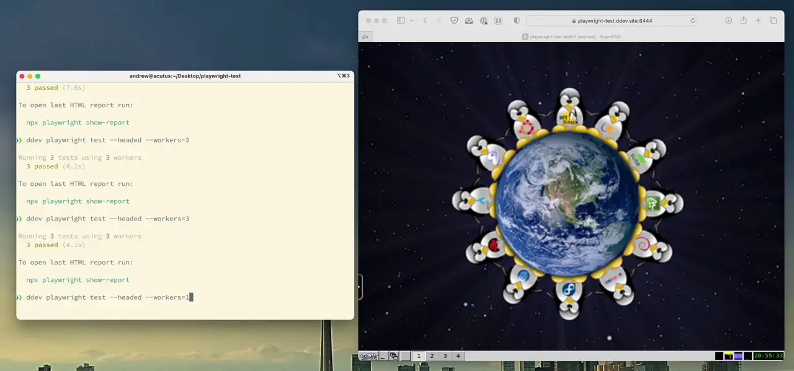

[](https://github.com/deviantintegral/ddev-playwright/actions/workflows/tests.yml)

# ddev-playwright <!-- omit in toc -->


_Example test validating phpinfo(), slowed down for the demo._

* [What is ddev-playwright?](#what-is-ddev-playwright)
* [Getting started](#getting-started)
* [Viewing test reports](#viewing-test-reports)
* [SQLite tmpfs mount](#sqlite-tmpfs-mount)
* [What the browser install sees](#what-the-browser-install-sees)
* [Contributing](#contributing)

## What is ddev-playwright?

This repository contains an addon for integrating Playwright tests into your ddev project.

Highlights include:

* Support for both npm and yarn.
* Support for running headless tests.
* Support for running headed tests with remote access to the UI through your web browser.
* Only installs the heavy Playwright dependencies if a given local opts in to them.
* Does not require running Playwright in ddev, in case developers prefer to run on the host on locals.
* Optimizations to reduce build time, especially on locals when ddev versions are upgraded.

## Getting started

The full setup workflow is:

1. **Install the addon** and commit the generated configuration.
2. **Initialize Playwright** inside the container (creates `package.json`, config, etc.).
4. **Run `ddev install-playwright`** to rebuild the web service with browser dependencies.

> **Tip:** Re-run `ddev restart` any time you update the Playwright
> version in `test/playwright/package.json` so the matching browser binaries are
> installed.

> **Tip:** Tests live in `test/playwright` by default. To use a different
> path (e.g. `tests/playwright`), add it to `.ddev/.env`:
> ```
> PLAYWRIGHT_TEST_DIR=tests/playwright
> ```
> then `ddev restart` before initializing Playwright. Substitute your
> chosen path for `test/playwright` in the commands below.

```console
# 1. Install the addon.
ddev add-on get Lullabot/ddev-playwright
git add .
git add -f .ddev/config.playwright.yml

# 2. Initialize Playwright (choose npm or yarn).
mkdir -p test/playwright
ddev exec -d /var/www/html/test/playwright npm init playwright@latest
# Or yarn:
# ddev exec -d /var/www/html/test/playwright yarn create playwright

# 3. Install Playwright browser dependencies and cache them.
ddev install-playwright

# To run playwright's test command.
ddev playwright test
# To run with the UI.
ddev playwright test --headed
# To generate playwright code by browsing.
ddev playwright codegen
# To view the HTML test report. The command prints the URL to open; no --host
# flag is needed.
ddev playwright show-report
# The report is accessible at https://<PROJECT>.ddev.site:9324
```

The following services are exposed with this addon:

| Service                 | URL                               | Notes                                                                                      |
|-------------------------|-----------------------------------|--------------------------------------------------------------------------------------------|
| KasmVNC                 | https://\<PROJECT>.ddev.site:8444 | Username is your local username. Password is `secret`.                                     |
| Playwright Test Reports | https://\<PROJECT>.ddev.site:9324 | This port is changed from the default to not conflict with running Playwright on the host. |

## Viewing test reports

`ddev playwright show-report` needs no flags. It serves the report from the
web container and prints the URL to open:

```
ddev-playwright: view the report at https://<PROJECT>.ddev.site:9324
ddev-playwright: the address Playwright prints below is the in-container one.

  Serving HTML report at http://0.0.0.0:9323. Press Ctrl+C to quit.
```

Playwright's own line is accurate, but describes the address *inside* the
container. DDEV's router publishes that as port 9324 on your host — 9323 is
left alone so it does not conflict with a Playwright report served directly on
the host.

If the report URL returns `502 Bad Gateway`, the report server is bound to an
address the router cannot reach. The router connects to the web container over
the Docker network, so `--host=127.0.0.1` (or `localhost`) binds to the
container's own loopback interface and shuts the router out. Drop the flag.
Binding `0.0.0.0`, which this command does for you, does not expose the report
to your network: container port 9323 is not published, so the router is still
the only way in.

## SQLite tmpfs mount

This addon mounts `/tmp/sqlite` as a tmpfs (in-memory) volume. The
[`@lullabot/playwright-drupal`](https://www.npmjs.com/package/@lullabot/playwright-drupal)
package uses this path for per-test SQLite database copies, and keeping
the I/O in memory significantly improves parallel test performance. Feel free to use it for your own database driven tests.

Because tmpfs is volatile, `ddev restart` will clear the volume.

## HTTPS certificates

DDEV signs every `*.ddev.site` certificate with a per-host
[mkcert](https://github.com/FiloSottile/mkcert) root CA. On container
start this addon makes Chromium, Firefox, and WebKit all trust that CA,
so `*.ddev.site` loads cleanly without `ignoreHTTPSErrors: true` in any
Playwright project. The setup lives in
`.ddev/web-entrypoint.d/mkcert-nssdb.sh`:

- **Chromium** reads `~/.pki/nssdb`; the script imports every mkcert
  root via `certutil`.
- **Firefox** (the Playwright build) reads an enterprise policy JSON
  whose path is given by `PLAYWRIGHT_FIREFOX_POLICIES_JSON`. The script
  writes that file; `config.playwright.yml` sets the env var.
- **WebKit** reads the system CA bundle directly, which DDEV already
  seeds, so it needs no extra handling.

## What the browser install sees

Browsers are installed in a Docker layer, and that layer needs to know which
version of Playwright your project has locked. A pre-start hook stages the
files a package manager reads to answer that question into
`.ddev/web-build/playwright`:

`package.json`, `package-lock.json`, `npm-shrinkwrap.json`, `yarn.lock`,
`.yarnrc.yml`, `.npmrc`, and any `*.tgz` in your Playwright directory (for
local tarball dependencies).

Yarn Berry projects also get `.yarn/releases`, `.yarn/patches`,
`.yarn/plugins` and `.yarn/cache`. Those are install inputs — `.yarn/cache`
holds the packages themselves, so a zero-install project still installs.
`.yarn/install-state.gz`, `.yarn/unplugged/` and `.yarn/build-state.yml` are
regenerated by `yarn install` and are left out. Note that `.yarn/cache` is
sized by your dependency tree, so a Berry project stages more than an npm one
— it changes only when your dependencies do, which is a rebuild you want.

Your specs, fixtures, and snapshot baselines are deliberately left out. The
staged directory is bind-mounted into the build, so everything in it becomes
part of that layer's cache key — staging a snapshot baseline would rebuild the
web image, and every layer after it, each time you updated a screenshot. None
of those files survive into the image anyway; the layer deletes its copy once
the browsers are cached.

The practical consequence: a dependency in your `package.json` must be
resolvable from the Playwright directory alone. A `file:` dependency pointing
outside it (`file:../../some-package.tgz`) will fail to install during the
build. Move the target inside the Playwright directory and reference it
relatively.

## Contributing

This project uses [conventional commits](https://www.conventionalcommits.org/)
for all commit messages. A [pre-commit](https://pre-commit.com/) hook is
included to validate commit messages locally before pushing.

To install pre-commit:

```console
pip install pre-commit
pre-commit install
pre-commit install --hook-type commit-msg
```

If you use Claude Code or GitHub Copilot, pre-commit is installed
automatically when a session starts.

## Similar Tools

[julienloizelet/ddev-playwright](https://github.com/julienloizelet/ddev-playwright) was a great inspiration for this work. It uses Playwright containers built by Microsoft for tests. [A few questions on the implementation](https://github.com/julienloizelet/ddev-playwright/issues/3) has some notes on the differences in the implementations. The main differences are:

1. This addon stacks Playwright and KasmVNC into the web container. This makes accessing the system being tested (like Drupal) much easier. For example, with a Drupal site Playwright can easily call `drush` or other CLI tools to set up tests.
2. The official Playwright containers do not ship with any sort of remote access to the Playwright UI. This repository (as well as `julienloizelet/ddev-playwright`) includes KasmVNC to run tests in headed mode or to generate code.
3. By stacking Playwright into the web container, it simplifies permissions for writing Playwright's test reports back out.
